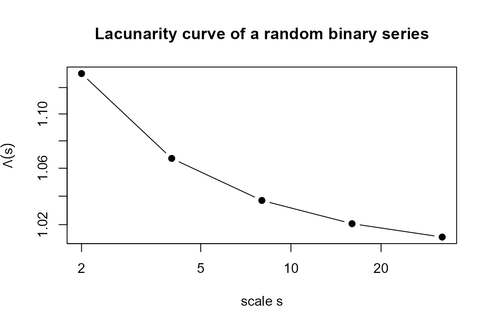
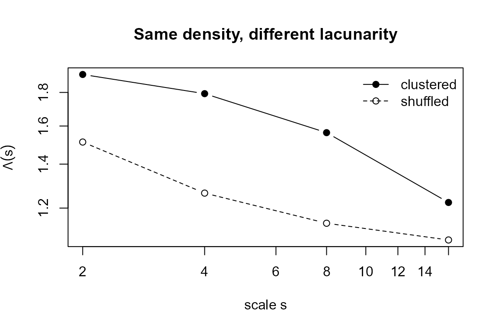
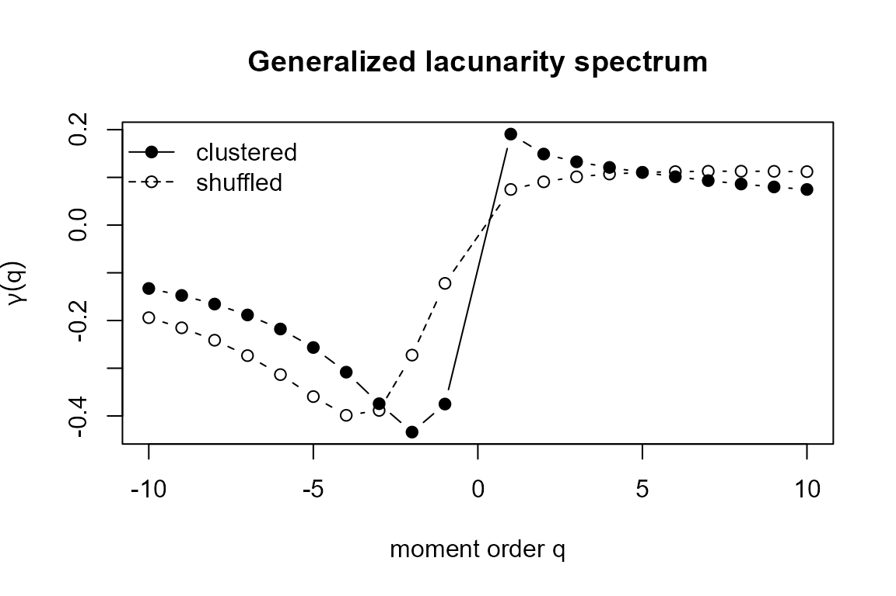

# Lacunarity and generalized lacunarity for binary time series

## Overview

**Lacunarity** is a scale-dependent measure of *translational
heterogeneity*: it quantifies how the gaps (the voids, or runs of zeros)
of a pattern are distributed in space. It was introduced by Mandelbrot
and made operational by Allain and Cloitre (1991) through the
*gliding-box* algorithm, later established as a general technique for
the analysis of spatial patterns by Plotnick et al. (1996). Its defining
feature is that two patterns with **the same density** of occupied sites
can have **very different lacunarities** if those sites are clustered
differently. Lacunarity is therefore a natural complement to fractal
dimension and to simple autocorrelation when describing the texture of
binary signals.

The `lacunarity` package implements two estimators for one-dimensional
binary series $`x = (x_1, \dots, x_N)`$ with $`x_t \in \{0, 1\}`$:

- [`lac()`](https://ikarobarreto.github.io/lacunarity/reference/lac.md)
  — the ordinary lacunarity index $`\Lambda(s)`$ and its scaling
  exponent $`\gamma`$;
- [`genlac()`](https://ikarobarreto.github.io/lacunarity/reference/genlac.md)
  — the generalized (multifractal-like) lacunarity $`\Lambda_q(s)`$ and
  the spectrum of exponents $`\gamma(q)`$.

``` r
library(lacunarity)
```

## Theory

### Gliding-box masses

Fix a box (a contiguous window) of size $`s`$ and slide it one
observation at a time along the series. At each of the $`N - s + 1`$
positions the **box mass** is the number of occupied sites it covers,
``` math

m \;=\; \sum_{t = j}^{\,j + s - 1} x_t ,
```
that is, a running sum of the series over a window of width $`s`$.
Sliding the box produces an empirical distribution of masses
$`Q(m, s)`$, the relative frequency of boxes carrying mass $`m`$ at
scale $`s`$. The package evaluates the masses on dyadic scales
$`s = 2^{i}`$, $`i = 1, \dots, p`$, with
$`p = \lceil \log_2(\text{longest run of ones}) \rceil`$.

### Moment generating function

All the estimators are built from the $`q`$-th moment of the box-mass
distribution,
``` math

Z(q, s) \;=\; \sum_{m} m^{q}\, Q(m, s) ,
```
computed by the helper
[`zqs()`](https://ikarobarreto.github.io/lacunarity/reference/zqs.md).
The argument `mat` is a two-column table with the distinct masses `x`
and their frequencies `freq`; internally the frequencies are normalised
to probabilities $`Q = \text{freq}/\sum \text{freq}`$.

### The lacunarity index

The lacunarity at scale $`s`$ is the ratio of the second moment to the
square of the first moment of the box masses,
``` math

\Lambda(s) \;=\; \frac{Z(2, s)}{\big[Z(1, s)\big]^{2}}
            \;=\; \frac{\langle m^{2} \rangle}{\langle m \rangle^{2}}
            \;=\; 1 + \frac{\operatorname{Var}(m)}{\langle m \rangle^{2}} .
```
The last identity shows that $`\Lambda(s) \ge 1`$ always, and that
lacunarity is exactly one plus the squared coefficient of variation of
the box masses:

- $`\Lambda(s) = 1`$ means every box of size $`s`$ carries the same mass
  — the pattern is translationally homogeneous at that scale;
- $`\Lambda(s) > 1`$ signals heterogeneity (gappiness), growing with the
  spread of the masses.

As the box grows, local fluctuations average out and $`\Lambda(s)`$
typically decays towards $`1`$. For self-similar sets the lacunarity
follows a power law (Allain and Cloitre 1991)
``` math

\Lambda(s) \;=\; \beta\, s^{-\gamma} ,
```
whose **lacunarity scaling exponent** $`\gamma`$ measures how fast the
heterogeneity decays with scale: large $`\gamma`$ means a quickly
homogenising pattern, while $`\gamma \to 0`$ marks a scale-invariant
one.
[`lac()`](https://ikarobarreto.github.io/lacunarity/reference/lac.md)
estimates the exponent `y` from the slope of $`\log_2 \Lambda(s)`$ on
$`\log_2 s`$ fitted through the origin, and also returns the vector `Ds`
of lacunarities $`\Lambda(s)`$ and the vector `s` of scales.

### Generalized lacunarity

Vernon-Carter et al. (2009) generalised the index by replacing the fixed
orders $`1`$ and $`2`$ with the generalized moments
$`Z(q, s) = \sum_m m^{q} Q(m, s)`$, giving
``` math

\Lambda_q(s) \;=\;
  \left[ \frac{Z(2q, s)}{\big[Z(q, s)\big]^{2}} \right]^{1/q} ,
\qquad q \in \{-10, \dots, 10\} \setminus \{0\}.
```
The exponent $`1/q`$ keeps the units of $`\Lambda_q(s)`$ those of a
ratio of quadratic masses for every $`q`$, so all orders are directly
comparable. The order $`q`$ acts as a magnifying glass: large positive
$`q`$ emphasises the dense (high-mass) boxes, while negative $`q`$
emphasises the sparse (low-mass) boxes. As in the ordinary case,
self-similar sets obey a power law
$`\Lambda_q(s) = \beta_q\, s^{-\gamma(q)}`$, and
[`genlac()`](https://ikarobarreto.github.io/lacunarity/reference/genlac.md)
estimates the **generalized scaling exponent** $`\gamma(q)`$ from the
(origin-constrained) slope of $`\log_{10}\Lambda_q(s)`$ on
$`\log_{10} s`$.

The whole curve $`q \mapsto \gamma(q)`$ is a *lacunarity spectrum*.
Following Vernon-Carter et al. (2009), a set is **monofractal** when
$`\gamma(q)`$ is essentially constant in $`q`$ — small and large gaps
organise the same way — and **multilacunar** when $`\gamma(q)`$ varies
appreciably with $`q`$, revealing a richer arrangement of small and
large gaps.
[`genlac()`](https://ikarobarreto.github.io/lacunarity/reference/genlac.md)
returns the scales `s`, the orders `q`, the exponents `yq`
($`= \gamma(q)`$) and the full matrix `Dqs` of $`\Lambda_q(s)`$ values.

## Worked examples

### A single series

We simulate a Bernoulli series with $`80\%`$ ones and compute its
lacunarity.

``` r
x <- rbinom(2000, size = 1, prob = 0.8)
rx <- lac(x)
rx
#> $y
#> [1] 0.01311362
#> 
#> $Ds
#> [1] 1.130717 1.067124 1.036955 1.020647 1.011371
#> 
#> $s
#>      [,1]
#> [1,]    2
#> [2,]    4
#> [3,]    8
#> [4,]   16
#> [5,]   32
```

`Ds` decreases towards $`1`$ as the scale grows, the signature of an
essentially homogeneous (gap-poor) pattern. The decay is clearest on a
log–log plot:

``` r
plot(rx$s, rx$Ds, log = "xy", type = "b", pch = 19,
     xlab = "scale s", ylab = expression(Lambda(s)),
     main = "Lacunarity curve of a random binary series")
abline(h = 1, lty = 2, col = "grey50")
```



### Same density, different texture

The point of lacunarity is that density alone does not determine
texture. Below, `z` is a strongly **clustered** sequence (blocks of ones
and zeros) and `w` is a random **shuffle** of `z`: both have exactly the
same number of ones, hence the same density, but a very different
spatial organisation.

``` r
block <- c(rep(c(rep(1, 8),  rep(0, 8)),  60),
           rep(c(rep(1, 16), rep(0, 16)), 60))
z <- block
w <- sample(block)               # same ones, gaps reshuffled

mean(z) == mean(w)               # identical density
#> [1] TRUE

lz <- lac(z)
lw <- lac(w)
c(clustered = lz$y, shuffled = lw$y)
#>  clustered   shuffled 
#> 0.19072431 0.07468284
```

The clustered series has a substantially larger lacunarity at every
scale:

``` r
ylim <- range(lz$Ds, lw$Ds)
plot(lz$s, lz$Ds, log = "xy", type = "b", pch = 19, ylim = ylim,
     xlab = "scale s", ylab = expression(Lambda(s)),
     main = "Same density, different lacunarity")
lines(lw$s, lw$Ds, type = "b", pch = 1, lty = 2)
legend("topright", c("clustered", "shuffled"),
       pch = c(19, 1), lty = c(1, 2), bty = "n")
```



Although `z` and `w` are indistinguishable by their mean, $`\Lambda(s)`$
cleanly separates the blocky texture from the random one — exactly the
information that density and most second-order summaries miss.

### The generalized lacunarity spectrum

Finally we compare the spectra $`\gamma(q)`$ of the clustered and the
random series with
[`genlac()`](https://ikarobarreto.github.io/lacunarity/reference/genlac.md).

``` r
gz <- genlac(z)
gw <- genlac(w)

plot(gz$q, gz$yq, type = "b", pch = 19,
     xlab = "moment order q", ylab = expression(gamma(q)),
     main = "Generalized lacunarity spectrum",
     ylim = range(gz$yq, gw$yq))
lines(gw$q, gw$yq, type = "b", pch = 1, lty = 2)
legend("topleft", c("clustered", "shuffled"),
       pch = c(19, 1), lty = c(1, 2), bty = "n")
```



The clustered series produces a spectrum that varies markedly with $`q`$
— a *multilacunar* texture in the terminology of Vernon-Carter et al.
(2009), where small and large gaps scale differently. The shuffled
series gives a nearly flat spectrum, the *monofractal* signature of a
structureless, single-scale gap distribution.

## Practical notes

- The input must be a binary vector of `0`s and `1`s. If the series is
  all zeros or all ones, there are no gaps to measure and the functions
  return a warning.
- Scales are dyadic ($`2, 4, 8, \dots`$) and capped by the longest run
  of ones, so longer and more structured series expose more scales and a
  more informative spectrum.
- Lacunarity is most useful as a *comparative* tool: compare a series
  against a reshuffled or simulated null with the same density to decide
  whether its texture is genuinely heterogeneous.

## References

Allain, C., and M. Cloitre. 1991. “Characterizing the Lacunarity of
Random and Deterministic Fractal Sets.” *Physical Review A* 44 (6):
3552–58. <https://doi.org/10.1103/PhysRevA.44.3552>.

Plotnick, Roy E., Robert H. Gardner, William W. Hargrove, Karen
Prestegaard, and Martin Perlmutter. 1996. “Lacunarity Analysis: A
General Technique for the Analysis of Spatial Patterns.” *Physical
Review E* 53 (5): 5461–68. <https://doi.org/10.1103/PhysRevE.53.5461>.

Vernon-Carter, J., C. Lobato-Calleros, R. Escarela-Perez, E. Rodriguez,
and J. Alvarez-Ramirez. 2009. “A Suggested Generalization for the
Lacunarity Index.” *Physica A: Statistical Mechanics and Its
Applications* 388 (20): 4305–14.
<https://doi.org/10.1016/j.physa.2009.07.032>.
